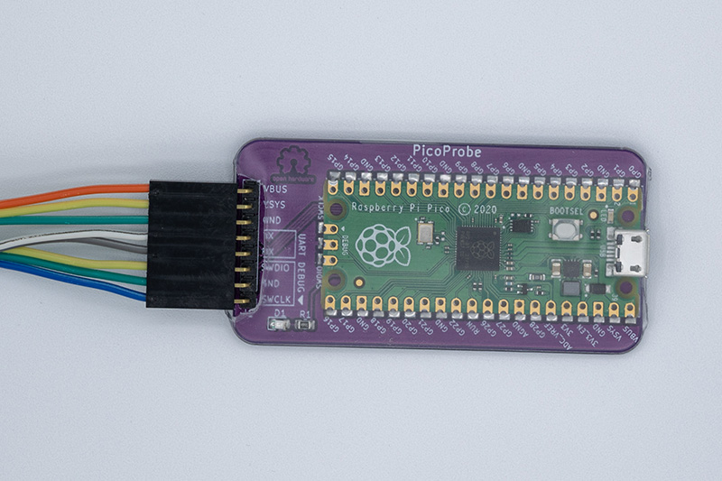
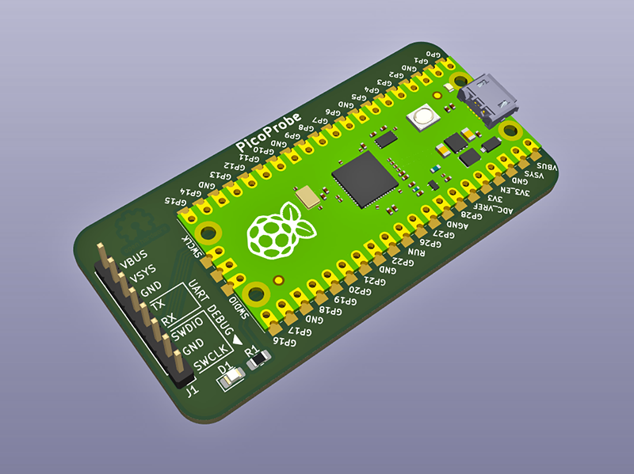
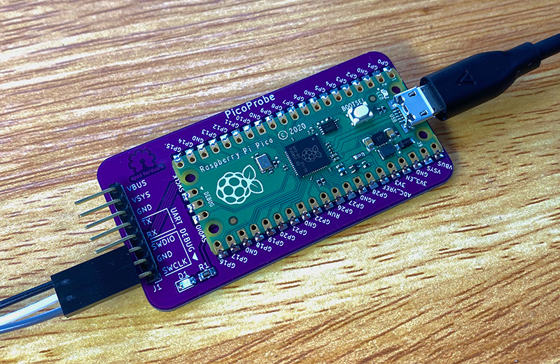
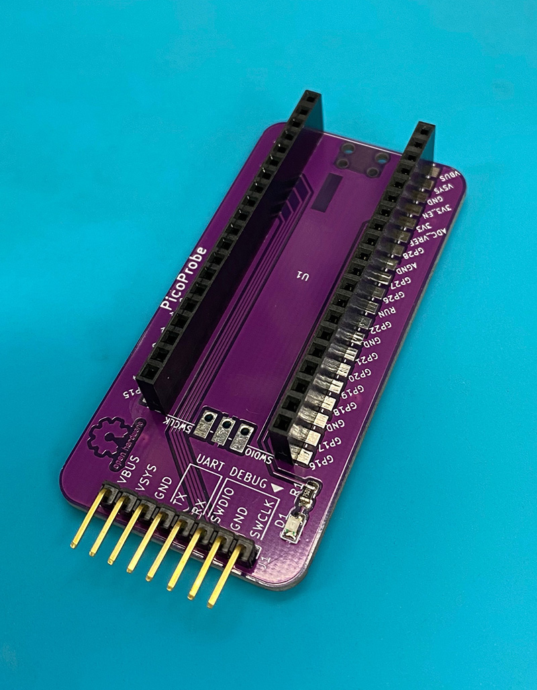
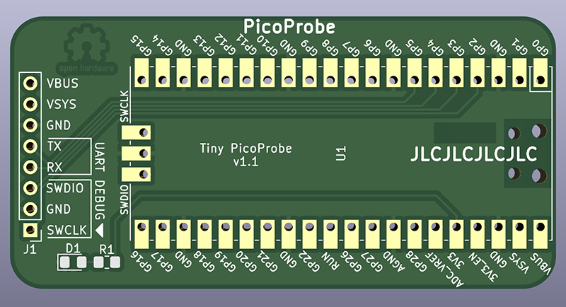

# tiny-picoprobe

Tiny PicoProbe is a small PCB to mount Raspberry Pi Pico, when you want to use [PicoProbe](https://github.com/raspberrypi/picoprobe) to debug your [Raspberry Pi Pico](https://www.raspberrypi.com/products/raspberry-pi-pico/) projects without a breadboard...

This was created to make it "handsfree" to update firmware when devloping [Fanpico (Smart PWM (PC) Fan Controller)](https://github.com/tjko/fanpico).

If you are not already familiar with PicoProbe see Appendix A in [Getting Started With Pico (PDF)](https://datasheets.raspberrypi.com/pico/getting-started-with-pico.pdf).

There is also tutorial here: [Raspberry Pi Pico and RP2040 - C/C++ Part 2: Debugging with VS Code](https://www.digikey.com/en/maker/projects/raspberry-pi-pico-and-rp2040-cc-part-2-debugging-with-vs-code/470abc7efb07432b82c95f6f67f184c0)

## PCB
PCB provides pinout to connect to Pico's SWD ("DEBUG") connector with flat (3-pin) ribbon cable, and it also has pinouts for UART and powering the Pico being programmed/debugged.

Designed with [KiCad](https://www.kicad.org/) 6.0.  PCB allows mounting Pico directly or using headers:

## Kerbers
Kerber files ready to be sent to a PCB maker (like JLCPCB, PCBWay, etc...):
* [PCB Version 1.0](kerbers/tiny-picoprobe-v1.zip)
* [PCB Version 1.1](kerbers/tiny-picoprobe-v1.1.zip)

You will only need the ZIP file (link above) to order PCBs. Simply upload the ZIP file to a PCB maker website. Then you typically only need to only select quantity and PCB color. If ordering from JLCPCB you can also choose to "Specify a location" in the Remove Order Number option (this will place order number on the PCB so that the Pico will cover it).

## Assembly
PCB contains footprints for a 0805 size SMD LED and resistor to provide power indicator. Power indicator is optional.

ID|Type|Description|Mouser P/N|LCSC P/N
--|----|-----------|----------|---------
D1|LED (0805)|Pad is suitable for handsoldering 0805 size LEDs, 0603 should work as well...|710-150080GS75000 (?)|C434432
R1|7.5k (0805)|Depending on LED used choose appropriate resistor. Green high-intensity 0805 LEDs typically work nicely with resistor in 5k to 10k range|603-RC0805FR-077K5L|C229003

Note, if soldering Pico directly on the PCB, then 1" diameter shrink tubing can be used to wrap the pico and PCB in nice insulated package.

## DIY Kits
DIY Kits are made available in limited quantity. Check availability here: [eBay](https://www.ebay.com/usr/oh6lxv)

## Credits
Idea for this PCB came from [Fabien-Chouteau/picoprobe-pcb](https://github.com/Fabien-Chouteau/picoprobe-pcb) (check his version as he sells it on Tindie).

KiCad Pico model/footprint that was used can be found here [ncarandini/KiCad-RP-Pico](https://github.com/ncarandini/KiCad-RP-Pico)
